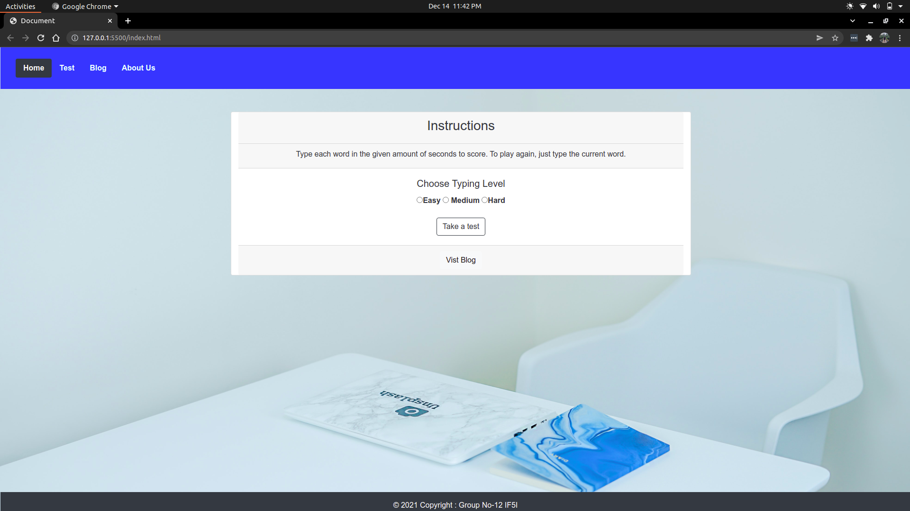

<h1 align="center">


  


<hr>

**Word Beater**
</h1>

A Micro Project for Client Side Scripting (CSS) IF5I 2021-22  
Everyone is looking for ways to be more productive both in the workplace and at home, and typing faster is a simple way to get more work done. Keeping it in mind we have created a project on word typing which engage you to type word fast and effectively within specified time frame and you from devoting mental energy to thinking about each letter as you type it. You'll be able to focus on the content of what you're typing in the fastest time frame. You can up-skills your fast typing using this game, so that we wouldn’t face spell mistakes when you will be in rush.


> ## ***Run Locally***

- Clone the project

    ```bash
        git clone https://github.com/AyushBhavsar/WordBeater.git
    ```

> ## ***Snapshots***

<center>

### **Home Page**
  

### **Test Page**
  

### **Blog Page**
  

### **About us Page**
  
</center>


## 📝 **Contributing**

Contributions are what make the open source community such an amazing place to be learn, inspire, and create. Any contributions you make are **greatly appreciated**.

1. Fork the Project
2. Create your Feature Branch (`git checkout -b feature/AmazingFeature`)
3. Commit your Changes (`git commit -m 'Add some AmazingFeature'`)
4. Push to the Branch (`git push origin feature/AmazingFeature`)
5. Open a Pull Request


## ✍️ Authors

- [@AryanPatil](https://www.github.com/AryanP45)
- [@AyushBhavsar](https://www.github.com/AyushBhavsar)

## 🏆 License

Distributed under the MIT License. See `LICENSE` for more information.


> ## Related

Here are some related projects

  - [Android Phone Silencer](https://github.com/AryanP45/Android-phone-silencer)

  - [Expense Manager](https://github.com/AryanP45/AndroidExpenseTracker)
